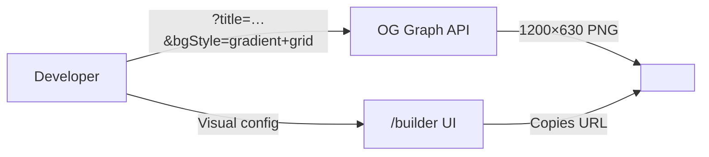
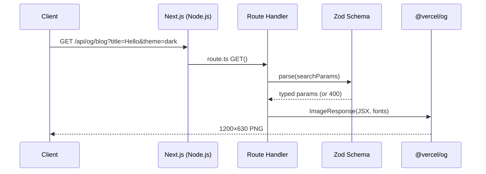
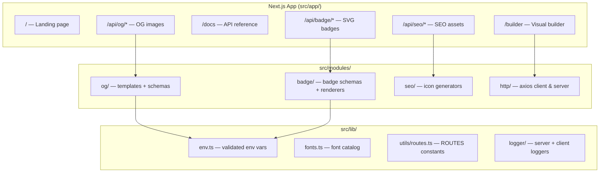
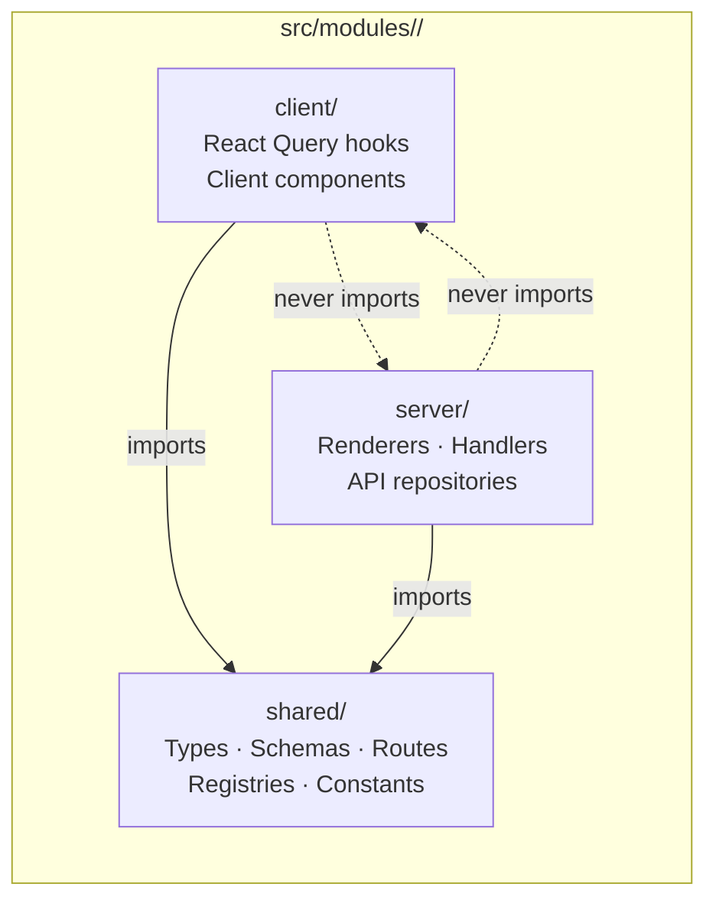
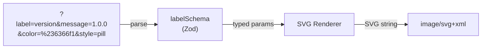
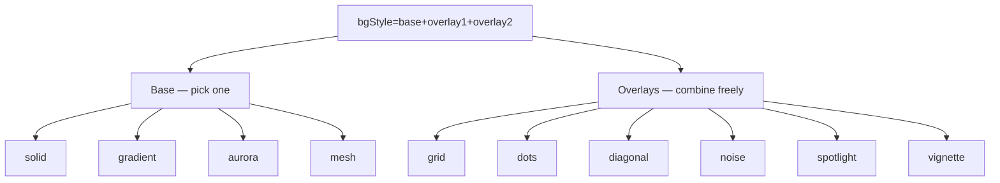
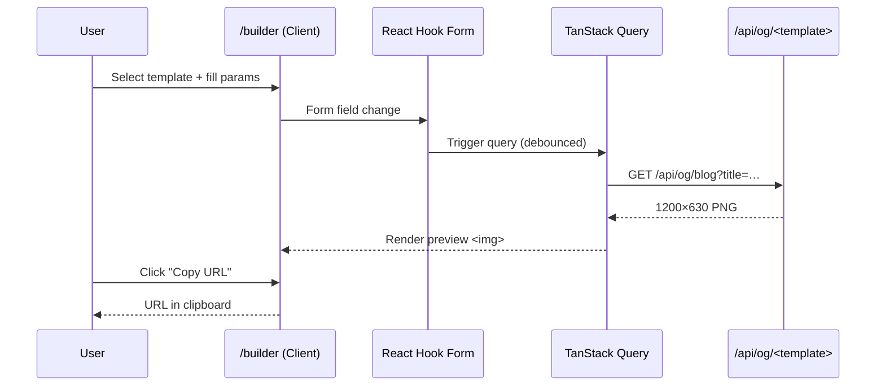
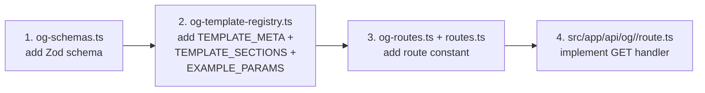
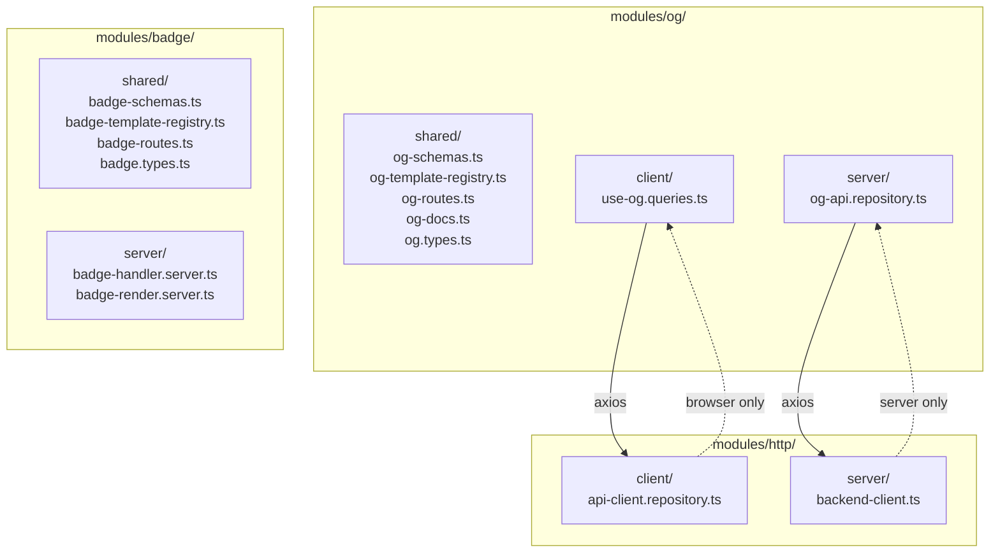

# OG Graph

**Self-hostable Open Graph image & badge generator — drop a URL, get a 1200×630 PNG.**

OG Graph is a Next.js application that exposes a REST API for generating social card images across 11 templates, 8 SVG badge types, and SEO asset variants. Developers paste one URL into their `<meta>` tags and ship.

🌐 **Live demo:** [placard.mfaouzi.com](https://placard.mfaouzi.com)

---

## Table of Contents

- [Overview](#overview)
- [Architecture](#architecture)
- [Project Structure](#project-structure)
- [API Reference](#api-reference)
  - [OG Image Templates](#og-image-templates)
  - [Badge API](#badge-api)
  - [SEO Assets](#seo-assets)
- [Template Parameters](#template-parameters)
- [Background Styles](#background-styles)
- [Getting Started](#getting-started)
- [Development](#development)
- [Module Architecture](#module-architecture)
- [Author](#author)

---

## Overview



OG Graph solves the social preview problem in one HTTP request:

| What you get          | How                                       |
| --------------------- | ----------------------------------------- |
| 11 OG image templates | `GET /api/og/<template>?params`           |
| 8 SVG badge types     | `GET /api/badge/<type>?params`            |
| SEO icon assets       | `GET /api/seo/<asset>?params`             |
| Visual builder        | `/builder` — configure, preview, copy URL |
| API reference         | `/docs`                                   |

---

## Architecture

### Request Flow



### High-Level System



### Module Layer Architecture



---

## Project Structure

```
og-graph/
├── src/
│   ├── app/
│   │   ├── layout.tsx          # Root layout, fonts, metadata
│   │   ├── page.tsx            # Landing page
│   │   ├── builder/page.tsx    # Visual builder
│   │   ├── docs/page.tsx       # API reference
│   │   └── api/
│   │       ├── og/             # 11 OG image endpoints
│   │       ├── badge/          # 8 SVG badge endpoints
│   │       └── seo/            # 4 SEO asset endpoints
│   ├── modules/
│   │   ├── og/                 # OG template system
│   │   │   └── shared/
│   │   │       ├── og-schemas.ts           # Zod schemas per template
│   │   │       ├── og-template-registry.ts # Template metadata + form sections
│   │   │       ├── og-routes.ts            # Route constants
│   │   │       └── og-docs.ts              # Param descriptor helpers
│   │   ├── badge/              # Badge generation
│   │   │   └── shared/
│   │   │       └── badge-schemas.ts        # Zod schemas per badge type
│   │   ├── seo/                # SEO asset generation
│   │   └── http/               # HTTP client/server factories
│   ├── components/
│   │   ├── ui/                 # shadcn/ui components
│   │   └── shared/             # Cross-module React components
│   ├── lib/
│   │   ├── env.ts              # Deployment URL resolution (NEXT_PUBLIC_DEPLOYMENT_URL → Vercel → localhost)
│   │   ├── fonts.ts            # Font catalog (60+ typefaces)
│   │   ├── logger/             # Pino server + client logger
│   │   └── utils/routes.ts     # ROUTES constants
│   └── assets/fonts/           # Bundled .woff2 / .ttf font files
├── docs/superpowers/specs/     # Architecture specs
├── ops/scripts/                # Bootstrap + font download scripts
├── next.config.ts              # React Compiler enabled
├── eslint.config.mts           # Flat ESLint flat config
└── .env.example                # Required env vars template
```

---

## API Reference

### OG Image Templates

All OG endpoints return a `1200×630` PNG (`image/png`) by default. Change output dimensions with the `target` parameter.

```
GET /api/og/<template>?<params>
```

#### Available Templates

| Template    | Endpoint            | Best for                      |
| ----------- | ------------------- | ----------------------------- |
| `general`   | `/api/og/general`   | Generic brand / landing page  |
| `gradient`  | `/api/og/gradient`  | Vivid gradient headline       |
| `blog`      | `/api/og/blog`      | Blog posts with author + tags |
| `minimal`   | `/api/og/minimal`   | Clean centered typography     |
| `article`   | `/api/og/article`   | Editorial long-form content   |
| `product`   | `/api/og/product`   | SaaS / product features       |
| `portfolio` | `/api/og/portfolio` | Personal developer profile    |
| `quote`     | `/api/og/quote`     | Bold pull-quote card          |
| `changelog` | `/api/og/changelog` | Release notes card            |
| `event`     | `/api/og/event`     | Conference / meetup           |
| `launch`    | `/api/og/launch`    | Product launch announcement   |

#### Output Dimensions (`target`)

| Value            | Width | Height | Platform             |
| ---------------- | ----- | ------ | -------------------- |
| `og` _(default)_ | 1200  | 630    | Facebook, generic OG |
| `twitter-large`  | 1200  | 628    | Twitter large card   |
| `twitter-small`  | 800   | 800    | Twitter small card   |
| `linkedin`       | 1200  | 627    | LinkedIn post        |

#### Quick Examples

```html
<!-- HTML <head> -->
<meta
  property="og:image"
  content="https://your-domain.com/api/og/blog?title=Hello+World&authorName=Jane+Doe&theme=dark&bgStyle=gradient%2Bgrid"
/>
```

```ts
// Next.js generateMetadata()
export async function generateMetadata(): Promise<Metadata> {
  return {
    openGraph: {
      images: [
        `${process.env.NEXT_PUBLIC_API_BASE_URL}/api/og/general?siteName=My+App&title=Page+Title&accentColor=%236366f1`,
      ],
    },
  };
}
```

---

### Badge API

All badge endpoints return `image/svg+xml`.

```
GET /api/badge/<type>?<params>
```

#### Badge Types

| Type           | Endpoint                  | Description                        |
| -------------- | ------------------------- | ---------------------------------- |
| `label`        | `/api/badge/label`        | Two-segment shields.io-style badge |
| `stat`         | `/api/badge/stat`         | Single metric with big number      |
| `status`       | `/api/badge/status`       | Service health indicator           |
| `progress`     | `/api/badge/progress`     | Progress bar                       |
| `score`        | `/api/badge/score`        | Score ring / percentage            |
| `socials`      | `/api/badge/socials`      | Social platform follower count     |
| `tech-stack`   | `/api/badge/tech-stack`   | Technology pill chips              |
| `availability` | `/api/badge/availability` | Open-to-work indicator             |

#### Badge Parameter Flow



#### Examples

```html
<!-- Version badge -->


<!-- Service status -->


<!-- Test coverage -->


<!-- Tech stack -->


<!-- GitHub followers -->


<!-- Availability -->

```

---

### SEO Assets

Dynamically generated icon and manifest assets.

| Asset            | Endpoint                    | Size     | Format |
| ---------------- | --------------------------- | -------- | ------ |
| Favicon          | `/api/seo/favicon`          | 32×32    | PNG    |
| Apple touch icon | `/api/seo/apple-touch-icon` | 180×180  | PNG    |
| Manifest icon    | `/api/seo/manifest-icon`    | 512×512  | PNG    |
| Twitter card     | `/api/seo/twitter-card`     | 1200×628 | PNG    |

---

## Template Parameters

### Base Parameters (all templates)

| Param            | Type                                               | Default         | Description                         |
| ---------------- | -------------------------------------------------- | --------------- | ----------------------------------- |
| `theme`          | `dark \| light \| auto`                            | `dark`          | Color theme                         |
| `target`         | `og \| twitter-large \| twitter-small \| linkedin` | `og`            | Output dimensions                   |
| `fontFamily`     | string                                             | `geist`         | Typography preset (60+ fonts)       |
| `bgStyle`        | string                                             | `gradient+grid` | Composable background tokens        |
| `bgTone`         | `dark \| light \| custom`                          | `dark`          | Background tone preset              |
| `bgCustomColor`  | hex                                                | —               | Custom background base color        |
| `bgGradientFrom` | hex                                                | —               | Gradient start color override       |
| `bgGradientTo`   | hex                                                | —               | Gradient end color override         |
| `logo`           | URL                                                | —               | Logo image URL                      |
| `logoWidth`      | number                                             | `100`           | Logo width in px (10–400)           |
| `logoHeight`     | number                                             | —               | Logo height in px (auto if omitted) |

### Template-Specific Parameters

#### `general`

| Param         | Type   | Default     | Description                         |
| ------------- | ------ | ----------- | ----------------------------------- |
| `siteName`    | string | `Site Name` | Brand / website name                |
| `title`       | string | —           | Page title (optional hero override) |
| `description` | string | —           | Subtitle text (max 2 lines)         |
| `accentColor` | hex    | `#6366f1`   | Title underline / logo border ring  |

#### `gradient`

| Param           | Type   | Default     | Description                        |
| --------------- | ------ | ----------- | ---------------------------------- |
| `siteName`      | string | `Site Name` | Lower subheading                   |
| `title`         | string | —           | Main heading with gradient applied |
| `description`   | string | —           | Paragraph below heading            |
| `gradientFrom`  | hex    | `#00e887`   | Gradient start color               |
| `gradientTo`    | hex    | `#00e0f3`   | Gradient end color                 |
| `gradientAngle` | number | `90`        | Gradient direction in degrees      |

#### `blog`

| Param          | Type   | Default      | Description                     |
| -------------- | ------ | ------------ | ------------------------------- |
| `title`        | string | `Blog Title` | Post title (max 3 lines)        |
| `tags`         | string | —            | Comma-separated tags (up to 4)  |
| `authorName`   | string | —            | Author display name             |
| `authorPhoto`  | URL    | —            | Author avatar image             |
| `authorHandle` | string | —            | Social handle e.g. `@janedoe`   |
| `readingTime`  | string | —            | e.g. `5 min read`               |
| `publishDate`  | string | —            | ISO 8601 date e.g. `2026-04-28` |
| `dateLocale`   | string | —            | BCP 47 locale e.g. `fr-FR`      |
| `siteDomain`   | string | —            | Breadcrumb domain               |
| `banner`       | URL    | —            | Banner image URL                |
| `accentColor`  | hex    | `#6366f1`    | Accent bar color                |

#### `minimal`

| Param         | Type   | Default   | Description                          |
| ------------- | ------ | --------- | ------------------------------------ |
| `title`       | string | `Title`   | Large centered heading (max 3 lines) |
| `description` | string | —         | Subtext below title (max 2 lines)    |
| `eyebrow`     | string | —         | ALL-CAPS small label above title     |
| `bgColor`     | hex    | —         | Override background color            |
| `textColor`   | hex    | —         | Override primary text color          |
| `accentColor` | hex    | `#6366f1` | Eyebrow and bottom border accent     |

#### `article`

| Param             | Type   | Default         | Description                             |
| ----------------- | ------ | --------------- | --------------------------------------- |
| `title`           | string | `Article Title` | Headline (max 3 lines)                  |
| `excerpt`         | string | —               | 1–2 sentence teaser (max 2 lines)       |
| `authorName`      | string | —               | Author name                             |
| `authorPhoto`     | URL    | —               | Author avatar                           |
| `publicationName` | string | —               | Newsletter / publication brand          |
| `publicationLogo` | URL    | —               | Publication logo                        |
| `readingTime`     | string | —               | e.g. `8 min read`                       |
| `publishDate`     | string | —               | ISO 8601 date                           |
| `dateLocale`      | string | —               | BCP 47 locale                           |
| `accentColor`     | hex    | `#f59e0b`       | Left edge accent bar + publication name |

#### `product`

| Param         | Type   | Default   | Description                         |
| ------------- | ------ | --------- | ----------------------------------- |
| `productName` | string | `Product` | Large product name                  |
| `tagline`     | string | —         | One-liner value proposition         |
| `feature1`    | string | —         | First feature bullet                |
| `feature2`    | string | —         | Second feature bullet               |
| `feature3`    | string | —         | Third feature bullet                |
| `badge`       | string | —         | Small pill badge e.g. `v2 Live`     |
| `cta`         | string | —         | CTA text e.g. `Get Started Free`    |
| `screenshot`  | URL    | —         | Product screenshot                  |
| `accentColor` | hex    | `#8b5cf6` | Badge, CTA pill, feature dots, glow |

#### `portfolio`

| Param           | Type            | Default     | Description                              |
| --------------- | --------------- | ----------- | ---------------------------------------- |
| `name`          | string          | `Your Name` | Full name — largest text element         |
| `role`          | string          | —           | Job title e.g. `Full-Stack Developer`    |
| `bio`           | string          | —           | One-liner personal tagline               |
| `avatar`        | URL             | —           | Avatar image                             |
| `skills`        | string          | —           | Comma-separated tech tags (up to 6)      |
| `githubHandle`  | string          | —           | GitHub username                          |
| `twitterHandle` | string          | —           | Twitter/X handle                         |
| `websiteUrl`    | URL             | —           | Personal site URL                        |
| `location`      | string          | —           | City / country                           |
| `available`     | `true \| false` | `false`     | Shows green "Open to work" badge         |
| `accentColor`   | hex             | `#3b82f6`   | Skill chips, social handles, avatar ring |

#### `quote`

| Param         | Type   | Default                   | Description                     |
| ------------- | ------ | ------------------------- | ------------------------------- |
| `quote`       | string | `Build fast. Ship often.` | Primary quote text              |
| `author`      | string | —                         | Quote author                    |
| `kicker`      | string | —                         | Small category label            |
| `accentColor` | hex    | `#14b8a6`                 | Accent for quote bar and author |

#### `changelog`

| Param         | Type   | Default         | Description           |
| ------------- | ------ | --------------- | --------------------- |
| `productName` | string | `OG Graph`      | Product name          |
| `version`     | string | `v2.0.0`        | Release version       |
| `headline`    | string | `Major upgrade` | Release headline      |
| `change1`     | string | —               | First changelog item  |
| `change2`     | string | —               | Second changelog item |
| `change3`     | string | —               | Third changelog item  |
| `accentColor` | hex    | `#38bdf8`       | Accent color          |

#### `event`

| Param         | Type   | Default      | Description                     |
| ------------- | ------ | ------------ | ------------------------------- |
| `eventName`   | string | `Event Name` | Conference or event name        |
| `tagline`     | string | —            | Short event tagline or theme    |
| `eventDate`   | string | —            | ISO 8601 date e.g. `2026-09-15` |
| `dateLocale`  | string | —            | BCP 47 locale                   |
| `location`    | string | —            | City and country or venue name  |
| `host`        | string | —            | Organizer or host name          |
| `accentColor` | hex    | `#f97316`    | Accent color for date, dividers |

#### `launch`

| Param         | Type   | Default      | Description                             |
| ------------- | ------ | ------------ | --------------------------------------- |
| `productName` | string | `My Product` | Product or project name                 |
| `punchline`   | string | —            | Bold one-line value proposition         |
| `launchDate`  | string | —            | ISO date or freeform e.g. `Coming soon` |
| `highlight1`  | string | —            | First key highlight                     |
| `highlight2`  | string | —            | Second key highlight                    |
| `highlight3`  | string | —            | Third key highlight                     |
| `badge`       | string | —            | Pill badge text e.g. `Now live`         |
| `accentColor` | hex    | `#ec4899`    | Highlights and badge color              |

---

## Background Styles

The `bgStyle` parameter is a `+`-separated list of composable tokens. Pick one **base** and combine with any **overlay** tokens.



| `bgStyle` value           | Result                                    |
| ------------------------- | ----------------------------------------- |
| `solid`                   | Flat background                           |
| `gradient+grid`           | Gradient + grid lines _(default)_         |
| `aurora+dots+noise`       | Aurora effect with dots and noise texture |
| `mesh+vignette`           | Mesh background with darkened edges       |
| `gradient+spotlight+grid` | Gradient + spotlight glow + grid          |

---

## Getting Started

### Prerequisites

- Node.js 20+
- pnpm 9+

### Installation

```bash
# Clone the repo
git clone https://github.com/faouziMohamed/og-graph.git
cd og-graph

# Install dependencies
pnpm install

# (Optional) set deployment URL
cp .env.example .env
```

### Environment Variables

Only one variable is supported — everything else works out of the box.

| Variable                     | Required    | Description                                                                                                 |
| ---------------------------- | ----------- | ----------------------------------------------------------------------------------------------------------- |
| `NEXT_PUBLIC_DEPLOYMENT_URL` | ❌ optional | Canonical app URL. Falls back to `NEXT_PUBLIC_VERCEL_URL` (auto-set by Vercel) then `http://localhost:3000` |

### Running

```bash
pnpm dev        # Development server at http://localhost:3000
pnpm build      # Production build
pnpm start      # Start production server
pnpm lint       # Lint
pnpm lint:fix   # Lint + auto-fix
pnpm test       # Run tests
```

---

## Development

### Stack

| Layer            | Technology                             |
| ---------------- | -------------------------------------- |
| Framework        | Next.js 16 (App Router)                |
| Runtime          | Node.js (no edge runtime)              |
| Language         | TypeScript 5                           |
| Styling          | Tailwind CSS 4                         |
| UI components    | shadcn/ui + Radix UI                   |
| Forms            | React Hook Form + Zod                  |
| Data fetching    | TanStack Query v5                      |
| Image generation | `@vercel/og`                           |
| HTTP client      | Axios                                  |
| URL state        | nuqs                                   |
| Logging          | Pino                                   |
| Compiler         | React Compiler (`reactCompiler: true`) |

### Builder → Preview Data Flow



### Adding a New OG Template



### Font Catalog

60+ fonts are pre-bundled in `src/assets/fonts/`. Font catalog is defined in `src/lib/fonts.ts` and `src/modules/og/shared/og-font-catalog.ts`.

To download additional fonts:

```bash
python ops/scripts/download-fonts.py
```

---

## Module Architecture



### HTTP Layer Rules

- **Client components** → import from `src/modules/http/client/api-client.repository.ts`
- **Server code** → import from `src/modules/http/server/backend-client.ts`
- **Never cross the boundary** — importing the server client in browser code (or vice versa) is a build error

---

## Author

**Faouzi Mohamed**

Full-stack developer. Built OG Graph as a self-hostable alternative to paid social-card services.

|                |                                                                                                 |
| -------------- | ----------------------------------------------------------------------------------------------- |
| 🌐 Portfolio   | [mfaouzi.com](https://mfaouzi.com) · [dev.mfaouzi.com](https://dev.mfaouzi.com) _(in progress)_ |
| 🐙 GitHub      | [@faouziMohamed](https://github.com/faouziMohamed)                                              |
| 💼 LinkedIn    | [mohamed-faouzi](https://linkedin.com/in/mohamed-faouzi)                                        |
| 🐦 Twitter / X | [@fz_faouzi](https://twitter.com/fz_faouzi)                                                     |
| 📘 Facebook    | [faouzi.mohamed.97](https://facebook.com/faouzi.mohamed.97)                                     |
| 📸 Instagram   | [@faouzi*m*](https://instagram.com/faouzi_m_)                                                   |
| 🚀 Live app    | [placard.mfaouzi.com](https://placard.mfaouzi.com)                                              |

---

## License

MIT
